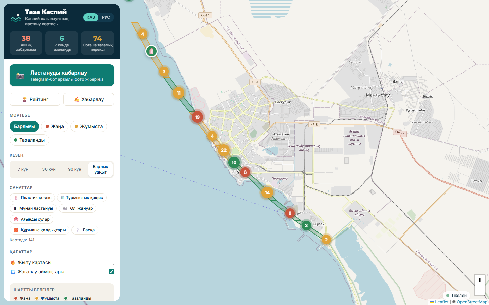
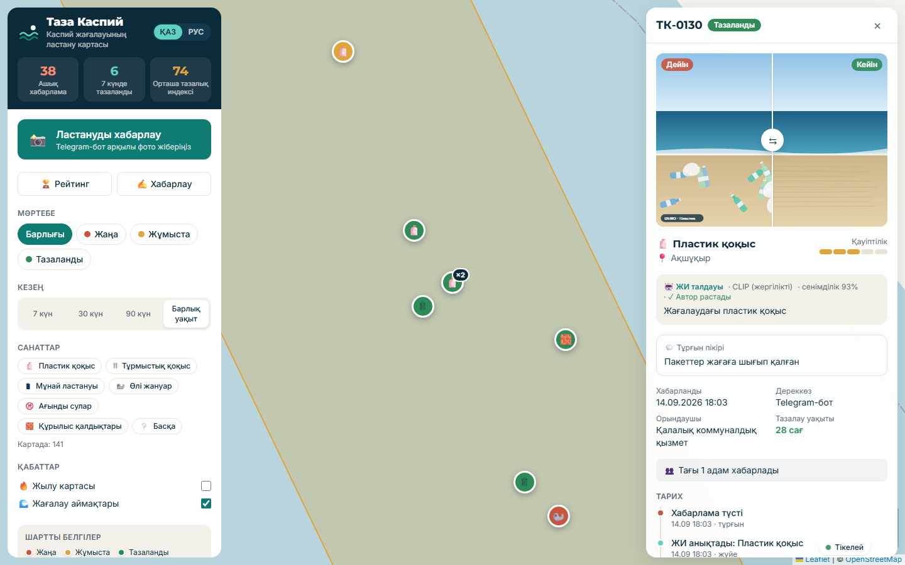
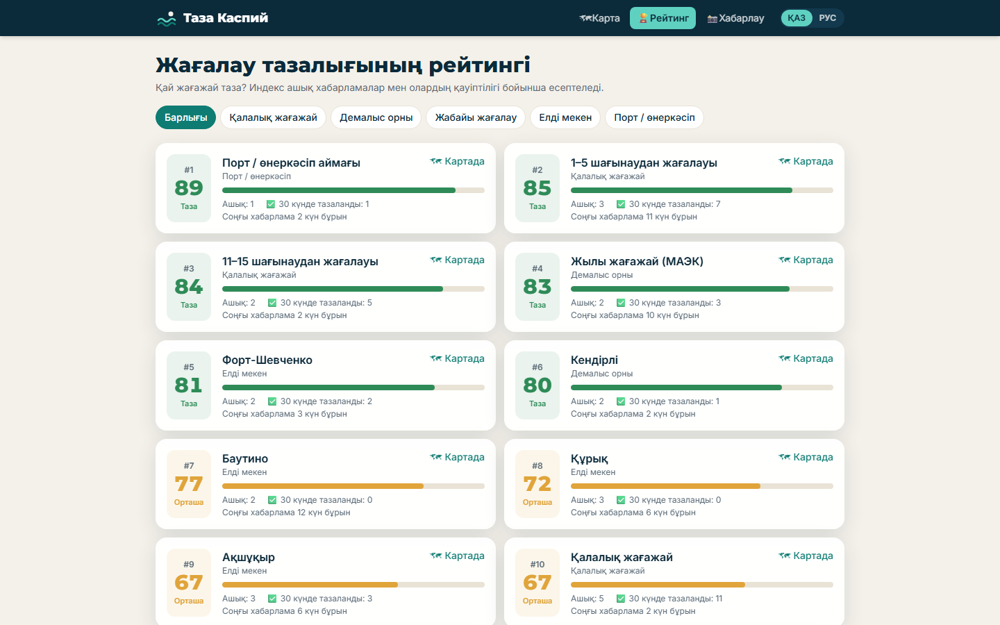
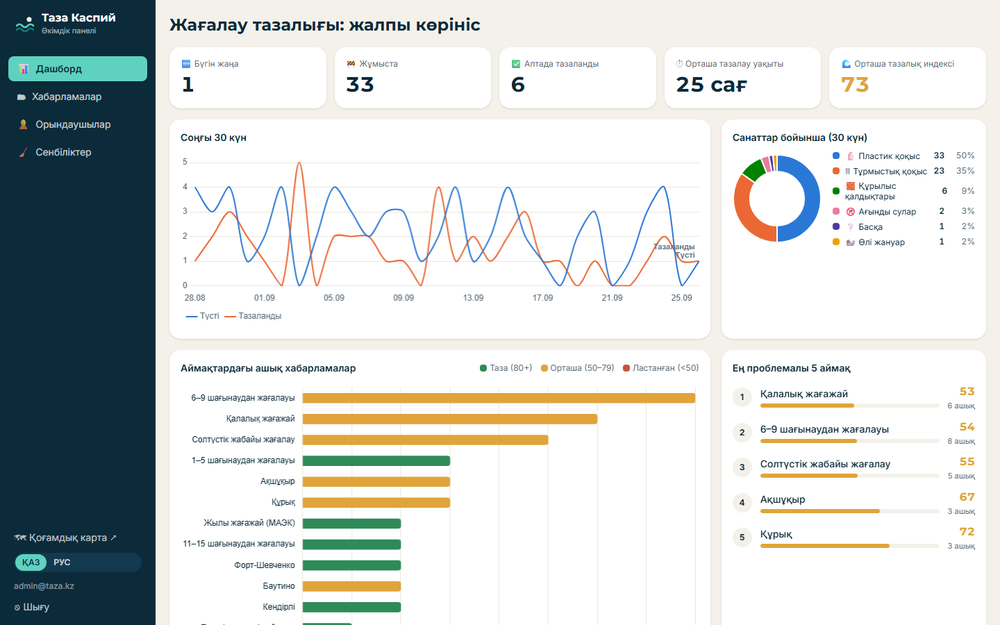
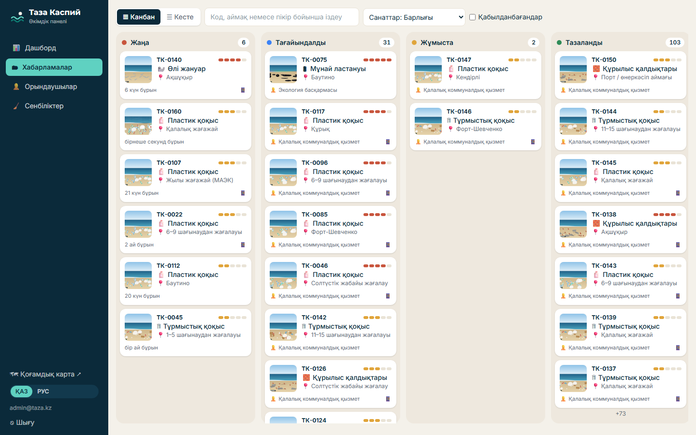
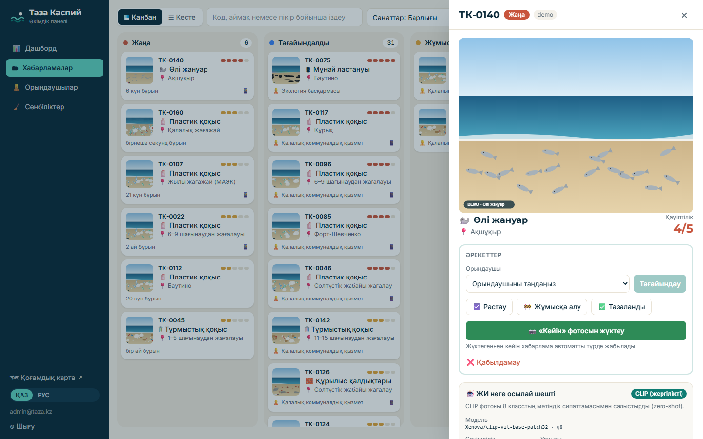
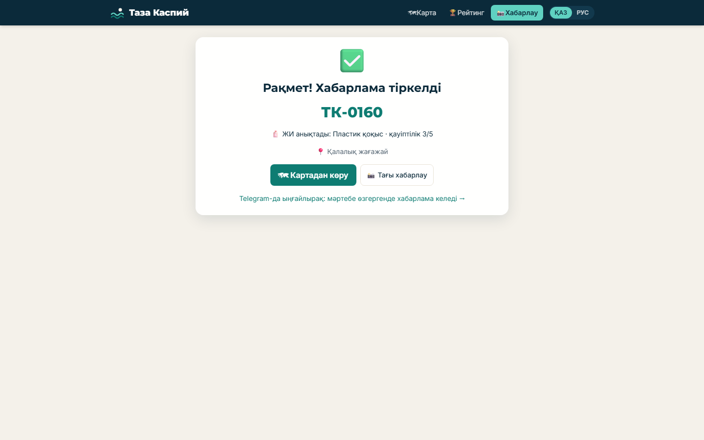
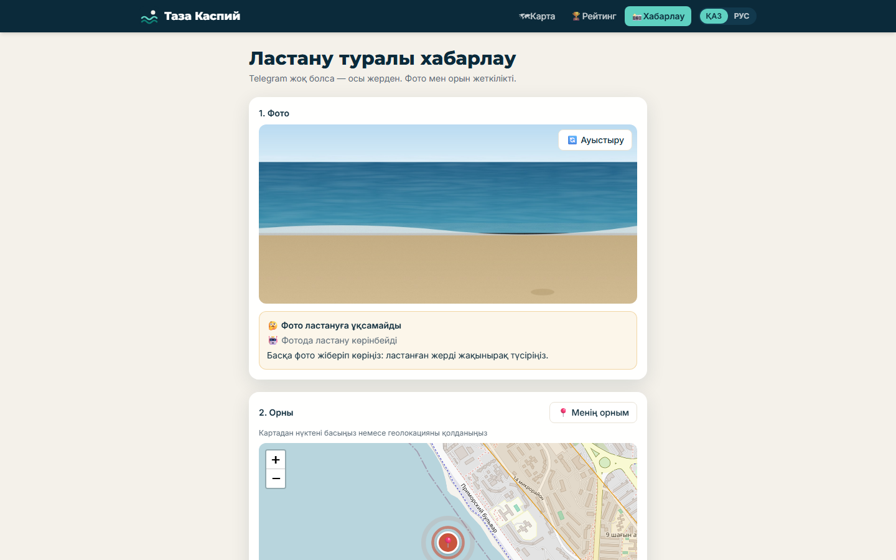
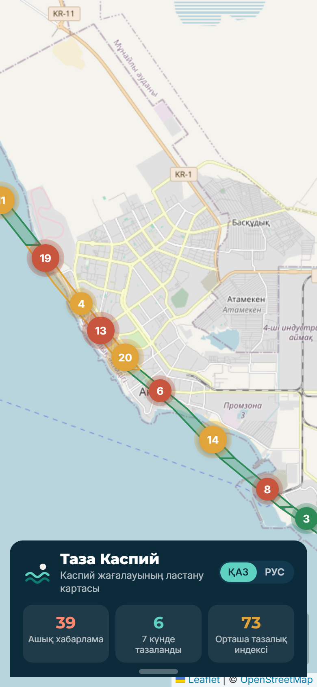
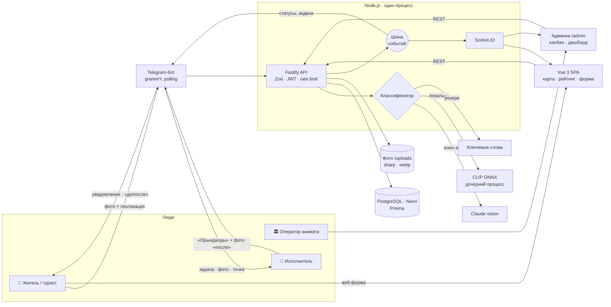

# Таза Каспий 🌊

**Житель сообщает о загрязнении берега → ИИ распознаёт → точка на карте → акимат назначает
исполнителя → берег убран → фото «после» → точка зелёная.**

Сервис мониторинга чистоты побережья Каспийского моря в Актау и Мангистауской области.
Сделан командой **ITech** на хакатоне **Smart City Aktau** (Mangystau Hub).



**Живое демо:** `https://<адрес>.trycloudflare.com` (адрес выдаётся при каждом запуске, см.
[«Запуск демо»](#запуск-демо)) · **Telegram-бот:** [@taza_kaspi_bot](https://t.me/taza_kaspi_bot)

---

## Проблема

Побережье Актау — главное место отдыха в городе, а берега области — дом для каспийского тюленя,
который занесён в Красную книгу МСОП как вымирающий вид. При этом:

- после выходных и летнего сезона пляжи остаются в пластике и бытовом мусоре;
- у портов и на промышленных участках бывают нефтяные пятна и сбросы;
- на диком берегу находят мёртвых тюленей и рыбу, и об этом важно узнать быстро;
- у жителя **нет простого канала**, чтобы сообщить о проблеме. Жалоба теряется в чатах и звонках,
  нет обратной связи, а у акимата нет общей картины: где грязно, кто убирает, как быстро.

## Решение

| Шаг            | Что происходит                                                                                                                    |
| -------------- | --------------------------------------------------------------------------------------------------------------------------------- |
| 1. Житель      | Отправляет фото и геолокацию в Telegram-бот (казахский по умолчанию, есть русский) или через веб-форму                            |
| 2. ИИ          | Определяет тип загрязнения и опасность 1–5; если на фото нет загрязнения, просит другое фото                                      |
| 3. Карта       | Точка сразу появляется на публичной карте с пульсацией и уведомлением; повторные сообщения о том же месте склеиваются в одно (×N) |
| 4. Акимат      | Оператор видит сообщение в канбане и назначает исполнителя                                                                        |
| 5. Исполнитель | Получает задачу в Telegram (фото, точка на карте) → «Бастадым» → «Орындалды» → фото «после»                                       |
| 6. Результат   | Точка зеленеет, индекс чистоты участка растёт, житель получает фото «до/после» и «Рақмет!»                                        |

### Кто пользуется

- **Жители и туристы:** сообщают о загрязнении, смотрят карту и рейтинг чистоты пляжей (`/zones`).
- **Оператор акимата:** панель `/admin` — канбан сообщений, назначение, дашборд с KPI, субботники.
- **Исполнители:** коммунальная служба, управление экологии, волонтёры, спасатели животных. Работают
  прямо в Telegram, без отдельного приложения.

### Как внедрить в работу акимата

1. Акимат получает доступ к панели, исполнители привязывают Telegram командой `/link КОД`.
2. Ссылку на бота размещают на пляжах (QR-код на табличках), в соцсетях акимата и на городском портале.
3. KPI дашборда (новые сегодня, среднее время устранения, индекс чистоты по участкам) становятся
   показателями для отчётов и планирования уборки.
4. Субботники: акимат создаёт событие, бот рассылает приглашение жителям, запись — одной кнопкой.

## Скриншоты

| Публичная карта + тепловая карта      | Карточка: «до/после», ИИ, история           | Рейтинг участков                |
| ------------------------------------- | ------------------------------------------- | ------------------------------- |
|  |  |  |

| Админка: дашборд                          | Канбан сообщений                       | «Почему ИИ так решил»                  |
| ----------------------------------------- | -------------------------------------- | -------------------------------------- |
|  |  |  |

| Веб-форма                                | Фото не похоже на загрязнение (422)  | Мобильная версия                     |
| ---------------------------------------- | ------------------------------------ | ------------------------------------ |
|  |  |  |

> Фото в демо-истории — сгенерированные SVG-плейсхолдеры с пометкой «DEMO», не реальные снимки.

## Архитектура



**Ключевые решения:**

- **Один процесс для API, бота и сокетов.** Проще деплоить, и на демо нечему развалиться.
- **Шина доменных событий.** Сервисы публикуют «репорт создан / статус изменён», а Socket.IO
  и бот на это подписаны. Карта, админка и уведомления в Telegram обновляются одним механизмом.
- **ИИ с цепочкой резервов.** Claude → локальный CLIP → ключевые слова. Классификатор никогда не
  бросает ошибку; CLIP работает в отдельном процессе, поэтому даже падение нативной библиотеки не
  роняет сервер.
- **Индекс чистоты участка (0–100).** `100 − Σ(вес опасности × затухание по возрасту)` по открытым
  сообщениям. Веса 4/8/14/22/35 для опасности 1–5; через 7 дней вес старого сообщения снижается и к
  30-му дню уменьшается вдвое.
- **Дубликаты.** Сообщение в радиусе 50 м той же категории за 48 ч присоединяется к существующему.
  На карте один маркер «×N»; закрытие родителя закрывает дубликаты и уведомляет всех авторов.
- **Привязка к Мангистау.** 12 участков: 7 в Актау (по микрорайонам, пляж, порт, дикий берег)
  и 5 в области (Ақшұқыр, Форт-Шевченко, Баутино, Құрық, Кендірлі). Полигоны приблизительные,
  лежат в [`zones.geojson`](server/prisma/seed/zones.geojson) и правятся через geojson.io.

## Стек

| Часть           | Технологии                                                                                            |
| --------------- | ----------------------------------------------------------------------------------------------------- |
| Сервер          | Node.js 20+, TypeScript, Fastify, Prisma, PostgreSQL 16 (Neon), Zod, sharp, pino                      |
| Бот             | grammY (polling; webhook-режим готов), цветные inline-кнопки Bot API                                  |
| Реальное время  | Socket.IO                                                                                             |
| ИИ              | Claude vision (`@anthropic-ai/sdk`, structured outputs) · CLIP (`@huggingface/transformers`, ONNX)    |
| Веб             | Vue 3, Vite, Pinia, vue-router, vue-i18n (kk/ru), Tailwind CSS 4                                      |
| Карты и графики | Leaflet, markercluster, leaflet.heat, OpenStreetMap · Chart.js                                        |
| Качество        | TypeScript strict, ESLint, Prettier, vitest (43 теста); сквозные проверки в Chrome по ходу разработки |
| Деплой сейчас   | Cloudflare quick tunnel с ноутбука (`start-demo.ps1`)                                                 |

## Что работает сейчас

- ✅ Полный цикл демо: бот → ИИ → карта live → назначение → исполнитель в Telegram → фото «после» → «до/после» автору.
- ✅ Публичная карта: участки по индексу, кластеры, тепловая карта, фильтры, карточка с историей, мобильная версия.
- ✅ Рейтинг участков `/zones` и веб-форма `/report` (с отказом, если на фото нет загрязнения).
- ✅ Админка: дашборд, канбан с перетаскиванием, drawer с «почему ИИ так решил», исполнители, субботники.
- ✅ Локальный ИИ (CLIP) без ключей; Claude подключается одной переменной.
- ✅ Демо-история: 150 сообщений за 60 дней (`npm run demo:seed`), чистый старт `npm run demo:reset`.

## Что дальше

- 🔜 Постоянный хостинг: VPS / Oracle Cloud Free + Docker + Caddy (HTTPS) + webhook бота.
- 🔜 Точные полигоны участков по OpenStreetMap вместе с акиматом.
- 🔜 Дообучение классификатора на реальных фото побережья (сейчас CLIP zero-shot).
- 🔜 QR-таблички на пляжах, публичная статистика для туристов, открытые данные.
- 🔜 Интеграция с системами акимата (e-Otinish / 109) и SLA на время устранения.

## Команда

Команда: **ITech**

| Участник         |
| ---------------- |
| Игілік Аян       |
| Қуаныш Бекарыс   |
| Сарсенов Ерболат |
| Жолекешов Ясин   |

## Структура репозитория

```
server/   Fastify API, Telegram-бот, ИИ, Prisma (schema, миграции, seed, демо-история)
web/      Vue 3: публичная карта, рейтинг, веб-форма, админка
docs/     API (curl-примеры), скриншоты
start-demo.ps1 / stop-demo.ps1   запуск/остановка демо через Cloudflare Tunnel
```

## Запуск демо

**Честно о текущем состоянии.** Прототип работает **с ноутбука команды** через
[Cloudflare quick tunnel](https://developers.cloudflare.com/cloudflare-one/connections/connect-networks/do-more-with-tunnels/trycloudflare/):
Cloudflare выдаёт временный адрес `https://*.trycloudflare.com` и проксирует запросы на ноутбук.
База данных — Neon (облачный PostgreSQL, Франкфурт), Telegram-бот работает в режиме polling.
Пока ноутбук выключен, демо недоступно, а адрес меняется при каждом запуске.

**План:** перенести на VPS (Oracle Cloud Free Tier или любой Ubuntu-сервер) с постоянным доменом.
Для этого в репозитории остаётся `docker-compose.yml`; Dockerfile, Caddy (HTTPS) и webhook-режим бота
будут добавлены при переносе.

### Одна команда

Нужны: Node.js 20+, [cloudflared](https://developers.cloudflare.com/cloudflare-one/connections/connect-networks/downloads/)
(`winget install Cloudflare.cloudflared`), заполненный `.env` (см. `.env.example`).

```powershell
npm install
npm run seed                                                       # миграции + зоны, исполнители, админ
npm run demo:seed                                                  # демо-история: 150 сообщений за 60 дней
powershell -ExecutionPolicy Bypass -File .\start-demo.ps1            # запуск
powershell -ExecutionPolicy Bypass -File .\start-demo.ps1 -Rebuild   # запуск с пересборкой
powershell -ExecutionPolicy Bypass -File .\stop-demo.ps1             # остановка
```

`start-demo.ps1` делает всё сам:

1. останавливает предыдущий запуск;
2. собирает web и server, если сборки нет (или с флагом `-Rebuild`);
3. поднимает туннель и забирает выданный адрес `https://….trycloudflare.com`;
4. записывает его в `PUBLIC_URL` в `.env`, чтобы ссылки «Картада» в боте вели на публичный адрес;
5. запускает сервер в прод-режиме: `NODE_ENV=production`, слушает только `127.0.0.1`, так что
   снаружи он доступен только через туннель;
6. проверяет `/api/health` локально и через туннель и крупно печатает ссылку.

| Что              | Адрес                                          |
| ---------------- | ---------------------------------------------- |
| Публичная карта  | `https://<адрес>.trycloudflare.com/`           |
| Рейтинг участков | `https://<адрес>.trycloudflare.com/zones`      |
| Веб-форма        | `https://<адрес>.trycloudflare.com/report`     |
| Админка          | `https://<адрес>.trycloudflare.com/admin`      |
| Проверка         | `https://<адрес>.trycloudflare.com/api/health` |

Логи: `.demo/server.log`, `.demo/cloudflared.log`.

### Перед питчем

```bash
npm run demo:reset            # показать, что будет удалено (ничего не удаляет)
npm run demo:reset -- --yes   # удалить всё, кроме демо-истории: тестовые сообщения, субботники, пользователей симулятора
```

**Прод-режим:**

- пароль админа сгенерирован; seed не запустится с `admin123` или паролем короче 12 символов;
- подсказки с демо-логином в сборке нет;
- у JWT свой случайный секрет.

**Если туннель не открывается (ошибка 1033).** Туннель идёт по `http2` (TCP 443): у части
провайдеров QUIC (UDP) режется, и соединение рвётся. Новый поддомен появляется в DNS через
10–20 секунд после запуска.

### Разработка

```bash
npm run dev:server   # API + бот + Socket.IO на :3000 (tsx watch)
npm run dev:web      # Vite на :5173 с прокси на :3000
npm test             # vitest
npm run bot:sim      # полный цикл бота без телефона
```

## ИИ

### Что делает

Каждое фото проходит классификацию и получает:

- `isPollution`: есть ли на фото загрязнение. Если нет, бот просит сделать другое фото.
- `category`: пластик, бытовой мусор, нефть, мёртвое животное, сточные воды, строительный мусор или другое.
- `severity`: опасность от 1 до 5. Нефтяное пятно или массовая гибель животных получают 5.
- `confidence`: уверенность. Если она ниже 0.6, бот выделяет кнопки «Дұрыс / Өзгерту»,
  и житель подтверждает или исправляет категорию.
- краткое описание на казахском и русском.

### Цепочка провайдеров

```
AI_PROVIDER=auto:   Claude (если есть ключ) → CLIP (локально) → mock
```

| Провайдер                                 | Где работает  | Когда используется                                                              |
| ----------------------------------------- | ------------- | ------------------------------------------------------------------------------- |
| **Claude** (`claude-sonnet-5`, vision)    | API Anthropic | Если задан `ANTHROPIC_API_KEY`. Лучше всего понимает сцену и комментарий жителя |
| **CLIP** (`Xenova/clip-vit-base-patch32`) | локально, CPU | По умолчанию, без ключей и без интернета                                        |
| **mock**                                  | локально      | Если ИИ недоступен. Тогда бот просит жителя выбрать категорию кнопками          |

Если провайдер падает или не укладывается в бюджет, берётся следующий. Классификатор никогда
не бросает исключений, поэтому демо не падает.

### Почему локальная модель

- **Работает без ключей и без оплаты.** Прототип полностью рабочий сразу после `git clone`.
- **Фото не уходят сторонним сервисам.** Для акимата это аргумент при внедрении.
- **Скорость:** ~250 мс на фото на обычном ноутбуке. Модель грузится при старте сервера за 2–3 с
  в фоне, запросы в это время уже принимаются.
- **Размер:** ~150 МБ (квантованная q8 версия). Скачивается один раз в `./models`.

### Как работает CLIP

CLIP (OpenAI, 2021) обучен сопоставлять картинки и текст. Мы не дообучаем модель, а используем
её в режиме **zero-shot**: сравниваем фото с английскими описаниями восьми классов, по 3 описания
на класс. Список описаний лежит в [clipMapping.ts](server/src/ai/clipMapping.ts):

- **6 видов загрязнения:** PLASTIC, TRASH, OIL, DEAD_ANIMAL, SEWAGE, CONSTRUCTION;
- **CLEAN:** чистый пляж или море;
- **IRRELEVANT:** селфи, помещение, скриншот.

Как из вероятностей получается ответ:

1. Вероятности описаний складываются внутри своего класса.
2. `isPollution = true`, если суммарная вероятность шести классов загрязнения не меньше 0.5.
3. Категория — самый вероятный класс загрязнения. `confidence` — его доля внутри загрязнения.
4. `severity` берётся базовой по категории и получает +1 для OIL, DEAD_ANIMAL и SEWAGE
   при `confidence > 0.7`.

В базу (`Report.aiRaw`) сохраняются провайдер, модель и **top-3 класса со скорами**. По ним
в админке можно показать, почему ИИ так решил.

Модель работает в **отдельном процессе**. Если нативный onnxruntime упадёт, API, бот и карта
продолжат работать на mock, а через 5 минут CLIP попробует перезапуститься.

### Проверка

```bash
npm run ai:test -- ./test-photos                       # папка или файлы, в конце таблица с top-3
npm run ai:test -- photo.jpg --provider clip           # принудительно один провайдер
npm run ai:test -- photo.jpg --comment "мұнай дақтары" # с комментарием жителя
```

Прогон на тестовых изображениях (сгенерированные сцены):

| фото                          | результат      | confidence | top-3                                    |
| ----------------------------- | -------------- | ---------- | ---------------------------------------- |
| бутылки и пакеты на песке     | PLASTIC 3/5    | 0.88       | PLASTIC 0.85, TRASH 0.07, CLEAN 0.03     |
| чистый пляж                   | не загрязнение | 0.67       | CLEAN 0.66, OIL 0.14, TRASH 0.06         |
| чёрные пятна, радужная плёнка | OIL 5/5        | 0.92       | OIL 0.90, CONSTRUCTION 0.03, SEWAGE 0.03 |
| скриншот с текстом            | не загрязнение | 0.99       | IRRELEVANT 0.99                          |

### Как подключить Claude

1. Получите ключ на [console.anthropic.com](https://console.anthropic.com).
2. Впишите его в `.env`: `ANTHROPIC_API_KEY=sk-ant-...`
3. Перезапустите сервер. При `AI_PROVIDER=auto` Claude станет первым в цепочке, CLIP останется запасным.

У Claude общий бюджет **15 с** на вызов. Повтор делается один раз и только на 429, 5xx
и сетевые ошибки; таймаут не повторяется. Ответ приходит строго по JSON-схеме
(structured outputs), поэтому битый JSON невозможен.

### Настройки

| Переменная          | По умолчанию      | Смысл                                      |
| ------------------- | ----------------- | ------------------------------------------ |
| `AI_PROVIDER`       | `auto`            | `auto` \| `claude` \| `clip` \| `mock`     |
| `ANTHROPIC_API_KEY` | —                 | ключ Claude; пусто — Claude пропускается   |
| `AI_MODEL`          | `claude-sonnet-5` | модель Claude                              |
| `MODELS_DIR`        | `./models`        | кэш CLIP                                   |
| `CLIP_DTYPE`        | `q8`              | `q8` (150 МБ, быстрее) или `fp32` (600 МБ) |

### Windows

onnxruntime требует **Visual C++ Redistributable 14.40+**. Со старым runtime процесс CLIP падает,
и классификатор переходит на mock. Обновить runtime:
`winget install Microsoft.VCRedist.2015+.x64`. В Docker (Linux) это не нужно.
